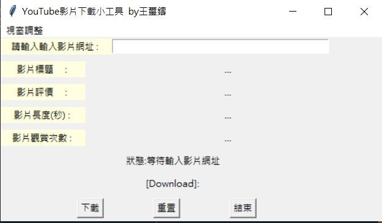
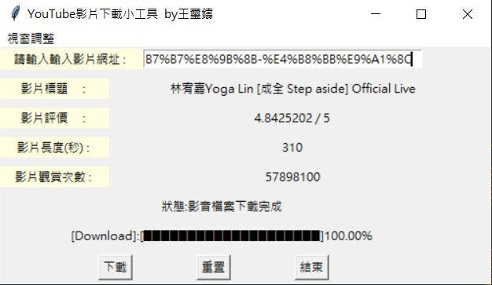

# Youtube-Video-Download
Youtube Video Download


一、設計此程式的動機
當初設計程式的構想是想要抓取PTT上的文章，後來又去爬了其他的網站，最後選擇了YouTube來進行爬蟲。程式的主軸在於爬取YouTube上的影音檔案來做使用，同時從網址獲取YouTube網頁的重要資訊(影片標題、影片評價、影片長度、影片觀賞次數)，並回傳進度條提醒下載進度。\n


二、程式設計目標
撰寫Python程式，自動擷取YouTube網頁上的影音檔案，網址可以任意輸入，只要是YouTube的影音網頁，其網站如圖所示。\n


\n
執行程式的時候，會先請求輸入網址，執行軟體後，會抓取網頁原始碼上資料(影片標題、影片評價、影片長度、影片觀賞次數)及進行影音檔下載，結束後並且會印出圖檔下載的狀況，如圖所示。
\n

\n



程式會自動在D槽路徑，建立資料夾「myYoutube」，並將網頁擷取下來的影音檔置於其中，其下載結果如圖所示。


三、本程式所使用的套件功能介紹
本程式主要運用4個套件，其功能說明如下：

pytube套件
我們在安裝整合開發環境Anaconda套件時，通常要另外安裝了pytube套件(語法: !pip install pytube)。使用pytube套件的函式，可以輕鬆抓取YouTube上的影片及資訊，其語法如下：
from pytube import YouTube
pytube套件提供的常用函式如下表：
```
函式	說明
download	影片下載
title	影片標題
views	欣賞次數
length	影片長度(單位為秒)
rating	影片評價
```
os套件
Python提供os套件來進行檔案的操作，可以取得檔案路徑、檔案大小、建立目錄、刪除目錄、刪除檔案與執行命令…等操作。
os套件提供相關函式，用以處理檔案路徑與名稱資訊，使用os套件必須先匯入，其語法如下：
import os
os套件提供的常用函式如下表：
```
函式	說明
abspath( )	取得檔案的絕對路徑
basename( )	取得路徑最後的檔案名稱
dirname( )	取得檔案的目錄路徑，如要取得目前Python檔案所在的目錄路徑，其語法為os.path.dirname(__file__)
exists( )	檢查檔案或路徑是否存在，其回傳值為True或False
getsize( )	取得檔案的大小，其回傳單位是Bytes
isabs( )	檢查該路徑是否為完整路徑
isfile( )	檢查該路徑是否為檔案
isdir( )	檢查該路徑是否為目錄
split( )	分割該路徑為目錄路徑與檔案名稱
splitdrive( )	分割該路徑為磁碟名稱與檔案路徑
join( )	合併檔案路徑和檔案名稱
```
tkinter套件
tkinter 套件除了視窗元件外，還有許多使用者介面元件，包括：標籤、按鈕、 文字方塊…等，提供給開發者運用，相關說明匯入tkinter套件的語法：
from tkinter import *
標籤（Label） 標籤本身是一個用來顯示資訊的元件，它常用來提示使用者該如何使用這個 介面，標籤與文字方塊都能夠顯示文字訊息，但是使用者無法在標籤內輸入文 字，而文字方塊可以。 建立標籤的語法如下： 
tkinter.Label(容器物件[,參數 1=值, 參數 2=值, …]) 
容器物件：是指標籤置於該物件之上。 
參數：是指對於標籤的相關設定，常見的標籤參數如表所示。
```
參數	說明
text	標籤文字
width	標籤寬度
height	標籤高度
background	標籤的背景顏色，簡稱 bg
foreground	標籤的文字顏色，簡稱 fg
padx	標籤文字與標籤物件邊緣的水平間距
pady	標籤文字與標籤物件邊緣的垂直間距
justify	對齊方式，有靠左（Left）、置中（Center）、靠右（Right）
font	標籤文字字體與大小，例如：font=('新細明體',14)
```
按鈕（Button） 按鈕在視窗軟體中，算是必備的項目，在很多應用程式中都會使用按鈕元 件，用來執行各種事件程序。其實在日常生活中，我們也不曾缺少按鈕，像是門鈴按鈕，當我們按下它時，電鈴會發出鈴聲，在電鈴例子中，按鈕所扮演的腳色， 很明顯的是「產生鈴聲」這個動作的啟動器。 在電腦的世界中，也是同樣的狀況，其運作的動作是由開發者用程式碼來定 義，在 tkinter 套件建立按鈕的語法如下：
tkinter.Button(容器物件[,參數 1=值, 參數 2=值, …])
容器物件：是指按鈕置於該物件之上。 
參數：是指對於按鈕的相關設定，常見的按鈕參數如表所示。
```
參數	說明
text	按鈕文字
width	按鈕寬度
height	按鈕高度
background	按鈕的背景顏色，簡稱 bg
foreground	按鈕的文字顏色，簡稱 fg
padx	按鈕文字與按鈕物件邊緣的水平間距
pady	按鈕文字與按鈕物件邊緣的垂直間距
justify	對齊方式，有靠左（Left）、置中（Center）、靠右（Right）
font	按鈕文字字體與大小，例如：font=('新細明體',14)
command	當使用者按下按鈕時，呼叫 command 所指定的函式
textvariable	按鈕文字之變數，可用作設定或取得按鈕的文字內容
underline	按鈕文字加上底線，預設值為-1，代表全部不加底線， 0 表示第 1 個字元，1 表示第 2 個字元，2 表示第 3 個 字元，依此類推
```

Threading套件
在 Python 中若要撰寫多執行緒（multithreading）的平行化程式，最基本的方式是使用 threading 這個模組來建立子執行緒。threading 是 Python 標準函式庫裡面的模組，所以不用特別安裝即可使用，雖然功能不是很多，但是基本多執行緒程式設計常用的功能它都有，匯入threading套件之語法:
import threading


先來介紹基本的程式碼:
```
函式	說明
threading.Thread(target=function, name="Thread名字", args=參數)	建立執行緒，將 target 指定為要執行的 function，name 就是設定的執行緒名稱，若要傳入參數，可以設定 args ，設定格式一定要是 Tuple(變數名稱, )
<Thread>.start()	開始執行指定的執行緒，start前面要放指定的執行緒名稱
<Thread>.join()	將主執行緒暫停，等待指定的執行緒結束，join 前面要放指定的執行緒名稱
threading.active_count()	查看目前有多少個執行緒
threading.enumerate()	查看目前使用執行緒的資訊
threading.current_thread()	查看目前在哪個執行緒中
```
